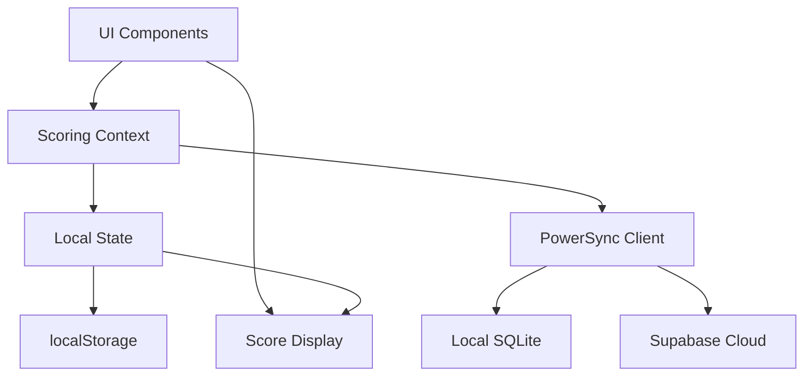

# ScoreMyClays - Development Scaffold

This is a comprehensive development scaffold for the ScoreMyClays clay shooting scoring application.
It's designed to work seamlessly with v0-generated UI/UX components and provides a complete
foundation for offline-first clay shooting score tracking.

## 🎯 Features

- **Offline-First Architecture**: Works with or without internet connectivity
- **Progressive Web App (PWA)**: Installable, app-like experience
- **Mobile-Optimized**: Touch-friendly interface designed for outdoor use
- **Clay Shooting Focused**: Specifically designed for Sporting Clays scoring
- **v0-Ready**: Structured to easily integrate v0-generated components
- **TypeScript**: Full type safety throughout the application
- **Modern Stack**: Next.js 14, React 18, Tailwind CSS, PowerSync

## 🏗️ Architecture

### Technology Stack

- **Frontend**: Next.js 14 with App Router
- **Styling**: Tailwind CSS with custom clay shooting utilities
- **State Management**: React Context + useReducer
- **Database**: Supabase + PowerSync for offline-first sync
- **PWA**: next-pwa for offline capabilities
- **UI Components**: Custom components + shadcn/ui compatibility
- **TypeScript**: Full type coverage for clay shooting domain

### Project Structure

```
src/
├── app/                    # Next.js App Router
│   ├── layout.tsx         # Root layout with providers
│   ├── page.tsx           # Home page
│   └── globals.css        # Global styles with clay shooting theme
├── components/
│   ├── ui/                # Reusable UI components
│   ├── layout/            # Layout components (header, navigation)
│   └── scoring/           # Clay shooting specific components
├── context/
│   ├── powersync-context.tsx  # Offline sync provider
│   └── scoring-context.tsx    # Scoring state management
├── hooks/                 # Custom React hooks
├── lib/
│   └── utils.ts          # Utility functions for clay shooting
├── types/
│   └── index.ts          # TypeScript definitions
└── styles/               # Additional styling
```

## 🚀 Getting Started

### Prerequisites

- Node.js 18+
- npm or yarn
- Optional: Supabase account (for cloud sync)

### Installation

1. **Install dependencies**:

   ```bash
   npm install
   ```

2. **Set up environment variables**:

   ```bash
   cp .env.example .env.local
   ```

   Edit `.env.local` with your configuration:

   ```env
   # Optional: For cloud sync (leave empty for offline-only mode)
   NEXT_PUBLIC_POWERSYNC_URL=your_powersync_url
   NEXT_PUBLIC_SUPABASE_URL=your_supabase_url
   NEXT_PUBLIC_SUPABASE_ANON_KEY=your_supabase_anon_key
   ```

3. **Start development server**:

   ```bash
   npm run dev
   ```

4. **Open** [http://localhost:3000](http://localhost:3000)

## 📱 PWA Setup

The app is configured as a Progressive Web App:

- **Manifest**: `/public/manifest.json` configured for clay shooting
- **Service Worker**: Automatically generated by next-pwa
- **Icons**: Place PWA icons in `/public/icons/`
- **Offline**: Core functionality works offline

### PWA Icons Needed

Create these icon sizes in `/public/icons/`:

- icon-72.png (72x72)
- icon-96.png (96x96)
- icon-128.png (128x128)
- icon-144.png (144x144)
- icon-152.png (152x152)
- icon-192.png (192x192)
- icon-384.png (384x384)
- icon-512.png (512x512)

## 🎨 Working with v0

This scaffold is optimized for v0 component integration:

### 1. Component Structure

All components follow shadcn/ui patterns that v0 expects:

```typescript
// Example component structure v0 can enhance
export function ScoringButton({ variant, children, onClick }: ButtonProps) {
  return (
    <Button
      variant={variant}
      size="touch-lg"
      onClick={onClick}
      className="clay-shooting-button"
    >
      {children}
    </Button>
  )
}
```

### 2. Design System

Pre-configured with clay shooting specific:

- Colors: hit (green), miss (red), no-bird (blue)
- Spacing: Touch-friendly sizing (44px minimum)
- Typography: High contrast for outdoor use
- Animations: Button press feedback

### 3. Integration Points

Key areas where v0 components can be dropped in:

- **`/src/components/scoring/`**: Scoring interface components
- **`/src/components/ui/`**: Base UI components
- **`/src/app/`**: Page layouts and routing

## 🏹 Clay Shooting Domain

### Core Concepts

- **Session**: A complete round of 100 targets (10 positions × 10 targets)
- **Position**: A shooting station with 10 targets
- **Shot**: Individual target result (hit/miss/no-bird)
- **Ground**: Shooting location name

### Scoring Rules

- **Hit**: Target broken (1 point)
- **Miss**: Target missed (0 points)
- **No Bird**: Faulty target, doesn't count (reshoot)

### State Management

The `ScoringContext` manages:

```typescript
interface ScoringState {
  currentSession: Session | null;
  currentPosition: number; // 0-9 for positions 1-10
  currentTarget: number; // 0-9 for targets 1-10
  isScoring: boolean;
  canUndo: boolean;
  lastAction: ShotResult | null;
}
```

## 🔧 Development Guidelines

### Adding New Components

1. **Create in appropriate directory**:

   ```typescript
   // src/components/scoring/target-display.tsx
   export function TargetDisplay({ targetNumber, result }: Props) {
     // Component implementation
   }
   ```

2. **Use existing types**:

   ```typescript
   import { ShotResult, Position } from '@/types';
   ```

3. **Follow naming conventions**:
   - PascalCase for components
   - camelCase for functions/variables
   - kebab-case for files

### Styling Guidelines

Use the pre-configured classes:

```typescript
// Clay shooting specific
<Button variant="hit" size="touch-lg">Hit</Button>
<Button variant="miss" size="touch-lg">Miss</Button>
<Button variant="no-bird" size="touch-lg">No Bird</Button>

// Utility classes
<div className="touch-target high-contrast">
<div className="score-large">78/100</div>
<div className="position-card">Position content</div>
```

### State Updates

Use the scoring context:

```typescript
const { state, recordShot, undoLastShot } = useScoring();

// Record a shot
recordShot('hit'); // 'hit' | 'miss' | 'no-bird'

// Undo last shot
undoLastShot();
```

## 📊 Data Flow



## 🔌 API Integration

### PowerSync (Offline-First)

The app uses PowerSync for offline-first data sync:

```typescript
// Context automatically handles sync
const { db, isConnected } = usePowerSync();

// Manual operations (advanced usage)
await db.execute('INSERT INTO sessions...');
```

### Local Storage Fallback

When PowerSync isn't available:

- Sessions saved to localStorage
- Automatic JSON serialization with Date handling
- Cache management for performance

## 🚀 Deployment

### Build for Production

```bash
npm run build
```

### Deploy to Vercel

```bash
npm run build
vercel --prod
```

The app is optimized for Vercel deployment with:

- Static generation where possible
- Edge runtime for global performance
- Automatic PWA asset optimization

## 🧪 Testing

### Development Testing

```bash
# Type checking
npm run type-check

# Linting
npm run lint

# Build verification
npm run build
```

### Clay Shooting Test Scenarios

Test these workflows:

1. **New Session**: Ground name → Shooter name → Position setup
2. **Scoring**: 10 targets per position × 10 positions
3. **Undo**: Undo last shot functionality
4. **Offline**: Test without internet connection
5. **PWA**: Install and test offline functionality

## 📁 Key Files Reference

### Configuration

- `next.config.js` - Next.js with PWA config
- `tailwind.config.ts` - Clay shooting design system
- `tsconfig.json` - TypeScript configuration

### Core Application

- `src/app/layout.tsx` - Root layout with providers
- `src/context/scoring-context.tsx` - Main state management
- `src/types/index.ts` - All TypeScript definitions

### Styling

- `src/app/globals.css` - Clay shooting specific styles
- CSS utilities for outdoor visibility and touch targets

## 🎯 Next Steps

1. **Add PWA icons** to `/public/icons/`
2. **Set up Supabase** (optional for cloud sync)
3. **Generate UI with v0** for specific screens
4. **Test on mobile devices** for touch interaction
5. **Deploy to Vercel** for testing

## 📞 Support

This scaffold follows the specifications in:

- `/docs/FUNCTIONAL_SPECIFICATION.md`
- `/docs/TECHNICAL_ARCHITECTURE.md`
- Clay shooting workflow requirements

For questions about clay shooting domain logic, refer to the research documents in `/research/`.

## 🚀 CI/CD Pipeline

ScoreMyClays includes a comprehensive GitHub Actions CI/CD pipeline:

### Features
- **Quality Assurance**: TypeScript, ESLint, Prettier, and security checks
- **PWA Validation**: Service worker and manifest validation
- **Clay Shooting Tests**: Domain-specific component validation
- **Automated Deployment**: Vercel integration with preview deployments

### Workflows
- **CI Pipeline** (`.github/workflows/ci.yml`): Quality checks and build validation
- **CD Pipeline** (`.github/workflows/deploy.yml`): Automated Vercel deployment

### Setup
1. Add GitHub repository secrets for Vercel integration
2. Configure branch protection rules for main branch
3. See `../docs/CI_CD_SETUP.md` for complete setup instructions

### Validation
Run the CI/CD validation script to check your setup:
```bash
# From project root
./scripts/validate-ci-cd.sh
```
