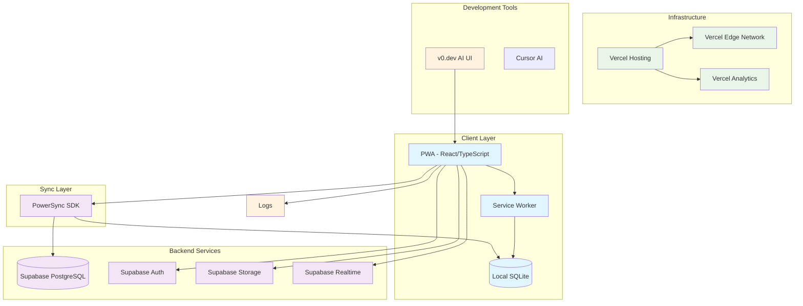
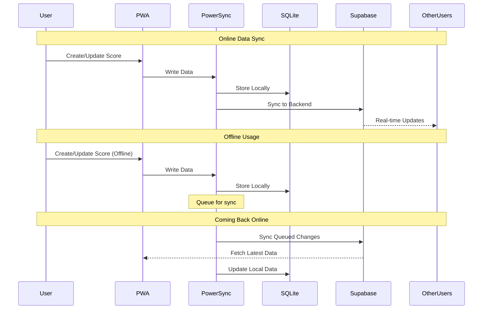
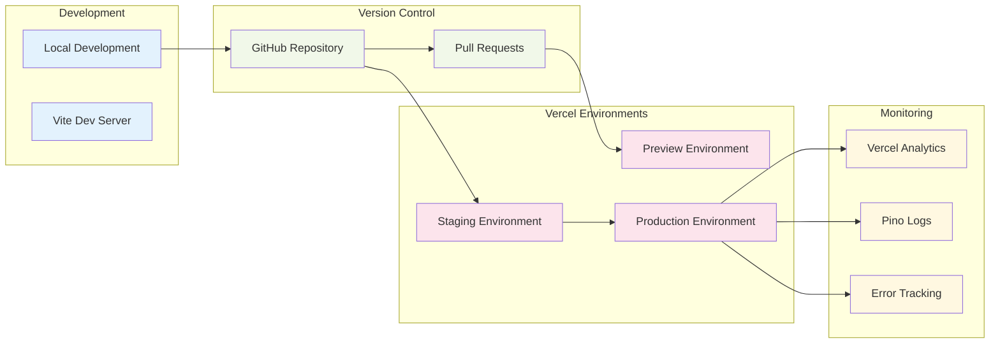
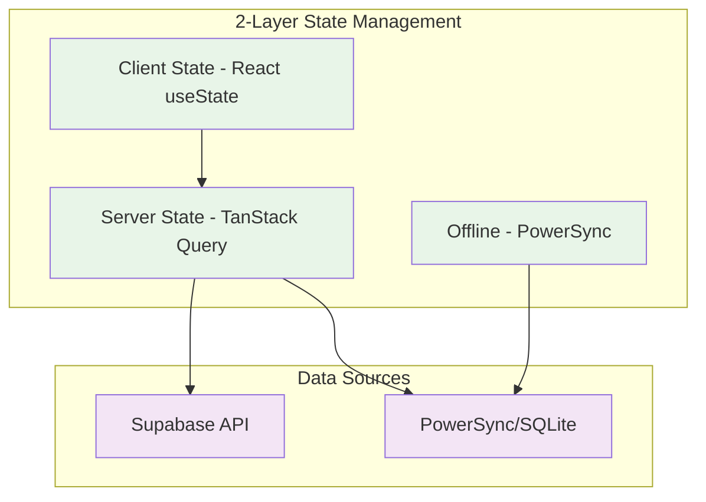
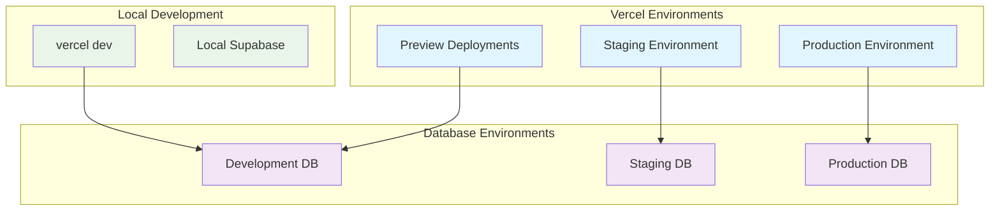
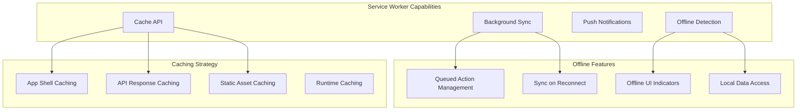
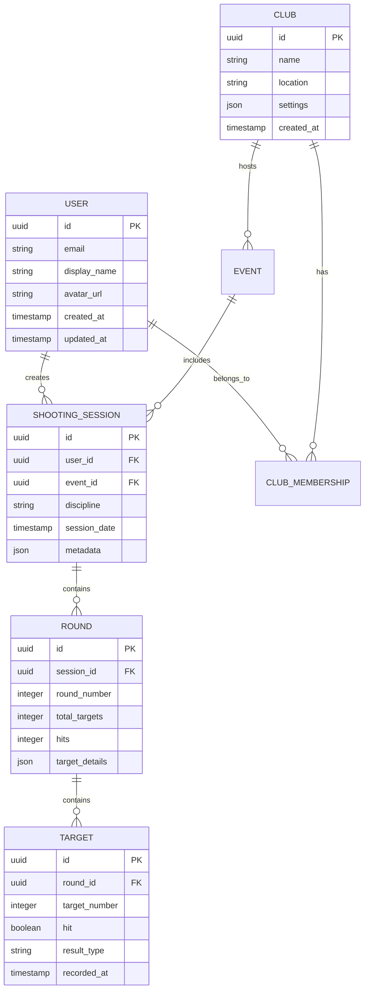
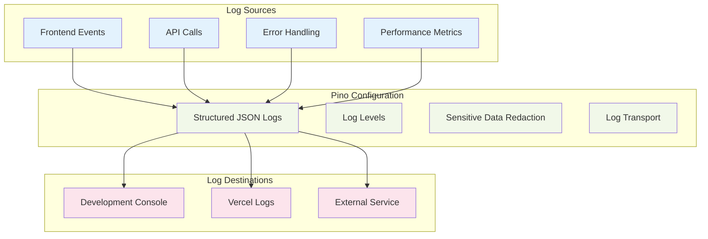
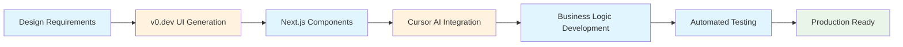
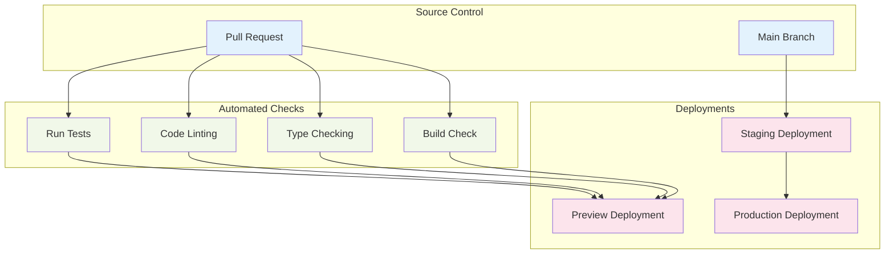

<!-- category: "Development" -->
<!-- order: 2 -->

# ScoreMyClays PWA Architecture

This document outlines the technical architecture for ScoreMyClays, an offline-first Progressive Web Application for clay shooting scoring and analytics.

## Overview

ScoreMyClays is designed as a modern, offline-first PWA that provides clay shooting enthusiasts with reliable scoring, analytics, and social features regardless of network connectivity. The architecture leverages cutting-edge technologies to deliver exceptional performance, offline capabilities, and seamless user experience.

## Core Architecture Stack

### Frontend Technologies (MVP-First)
- **Framework**: Next.js 14+ with App Router and TypeScript
- **Styling**: Tailwind CSS + shadcn/ui components
- **Server State**: TanStack Query (handles API calls and caching)
- **Client State**: React useState (keep it simple for MVP)
- **Forms**: Simple controlled inputs with basic validation
- **Testing**: Vitest (add E2E testing later)
- **PWA**: next-pwa for offline capabilities
- **UI Generation**: v0.dev AI-powered component generation

### Backend & Data Layer (MVP Focus)
- **Primary Database**: Supabase PostgreSQL
- **Authentication**: Supabase Auth
- **Offline Sync**: PowerSync SDK
- **Local Storage**: SQLite (via PowerSync)
- **Real-time Features**: Add Supabase Realtime later
- **File Storage**: Add Supabase Storage when needed

### Infrastructure & DevOps (Keep Simple)
- **Hosting**: Vercel (standard environments)
- **Logging**: console.log + Vercel's built-in logging
- **Monitoring**: Vercel Analytics (built-in)
- **CDN**: Vercel Edge Network (automatic)
- **SSL/Security**: Automatic HTTPS via Vercel

## Architecture Diagrams

### System Overview



### Data Flow Architecture



### Deployment Pipeline



## Technology Deep Dive

### Frontend Architecture

#### Next.js + TypeScript (AI-Agent Optimized)
- **Next.js 14+**: App Router, Server Components, and built-in optimizations
- **TypeScript**: Full type safety and enhanced developer experience
- **AI-Agent Friendly**: Simple, well-documented patterns that AI can easily understand and extend

#### Ultra-Simple State Management (MVP)


#### Styling & UI Components
- **Tailwind CSS**: Utility-first CSS framework for rapid styling
- **shadcn/ui**: High-quality, accessible React components
- **v0.dev Integration**: AI-powered component generation for rapid prototyping

#### AI-Agent Development Optimization (MVP Focus)
- **Ultra-Simple**: Only 2 state concepts - React useState + TanStack Query
- **Familiar Patterns**: Standard React patterns AI has seen millions of times
- **Minimal Dependencies**: Fewer libraries = less complexity for AI to manage
- **Incremental Complexity**: Add advanced features only when MVP is working

```typescript
// Ultra-simple scoring component (AI can easily understand and extend)
function ScoringPage() {
  const [currentShot, setCurrentShot] = useState(1);
  const [hits, setHits] = useState(0);
  const [discipline, setDiscipline] = useState<'ESP' | 'DTL' | 'Skeet'>('ESP');
  
  const recordHit = () => {
    setHits(hits + 1);
    setCurrentShot(currentShot + 1);
    // PowerSync automatically handles offline persistence
  };
  
  const recordMiss = () => {
    setCurrentShot(currentShot + 1);
  };
  
  return (
    <div className="p-6 max-w-md mx-auto">
      <h1 className="text-2xl font-bold">Shot {currentShot}/25</h1>
      <div className="space-y-4 mt-6">
        <button 
          onClick={recordHit}
          className="w-full bg-green-500 text-white p-4 rounded-lg"
        >
          HIT
        </button>
        <button 
          onClick={recordMiss}
          className="w-full bg-red-500 text-white p-4 rounded-lg"
        >
          MISS
        </button>
      </div>
      <p className="text-xl mt-6">Score: {hits}/25</p>
    </div>
  );
}
```

### Backend Architecture

#### Supabase as Backend-as-a-Service
- **PostgreSQL Database**: Robust relational database with full SQL support
- **Row Level Security (RLS)**: Fine-grained access control
- **Real-time Subscriptions**: Live data updates across clients
- **Edge Functions**: Serverless functions for custom business logic
- **Storage**: File and media storage with CDN delivery

#### PowerSync for Offline-First Architecture
- **Bidirectional Sync**: Real-time synchronization between local SQLite and PostgreSQL
- **Conflict Resolution**: Automatic handling of concurrent modifications
- **Selective Sync**: Sync only relevant data per user
- **Connection Resilience**: Robust handling of poor network conditions

### Infrastructure & Deployment

#### Vercel Platform Benefits
- **Global Edge Network**: Sub-100ms response times worldwide
- **Automatic Scaling**: Handle traffic spikes without configuration
- **Branch Previews**: Every pull request gets a preview URL
- **Environment Variables**: Secure configuration management
- **Built-in Analytics**: Performance and usage insights

#### Environment Strategy


## Progressive Web App Features

### Service Worker Strategy


### PWA Manifest Configuration
- **Install Prompts**: Native app-like installation experience
- **Splash Screens**: Custom splash screens for different devices
- **Theme Colors**: Consistent branding across the system UI
- **Display Modes**: Standalone app experience

## Data Model & Sync Strategy

### Core Data Entities


### PowerSync Sync Rules
```yaml
# PowerSync Sync Rules Configuration
bucket_definitions:
  user_data:
    parameters: 
      - select id as user_id from auth.users where id = request.user_id()
    data:
      - select * from users where id = bucket.user_id
      - select * from shooting_sessions where user_id = bucket.user_id
      - select * from rounds where session_id in (
          select id from shooting_sessions where user_id = bucket.user_id
        )
      - select * from targets where round_id in (
          select r.id from rounds r 
          join shooting_sessions s on r.session_id = s.id 
          where s.user_id = bucket.user_id
        )
  
  club_data:
    parameters:
      - select club_id from club_memberships where user_id = request.user_id()
    data:
      - select * from clubs where id = bucket.club_id
      - select * from events where club_id = bucket.club_id
```

## Logging and Monitoring

### Pino Logging Strategy


### Simple Logging Strategy (MVP)
```typescript
// Keep it simple for MVP - use console.log + Vercel's built-in logging
const logger = {
  info: (message: string, data?: any) => {
    console.log(`[INFO] ${message}`, data);
  },
  error: (message: string, error?: any) => {
    console.error(`[ERROR] ${message}`, error);
    // Vercel automatically captures console.error in production
  },
  debug: (message: string, data?: any) => {
    if (process.env.NODE_ENV === 'development') {
      console.log(`[DEBUG] ${message}`, data);
    }
  }
};

// Usage in components
function ScoringPage() {
  const recordHit = () => {
    logger.info('Shot recorded', { hit: true, shot: currentShot });
    // ... rest of logic
  };
}

// Add structured logging (Pino) later when you need it
```

## Security Considerations

### Authentication & Authorization
- **Supabase Auth**: Secure authentication with multiple providers
- **Row Level Security**: Database-level access control
- **JWT Tokens**: Secure, stateless authentication
- **Role-based Access**: Granular permission system

### Data Protection
- **End-to-End Encryption**: Sensitive data encryption at rest
- **HTTPS Everywhere**: All communication over secure channels
- **Input Validation**: Client and server-side validation
- **SQL Injection Protection**: Parameterized queries and ORM protection

### PWA Security
- **Content Security Policy**: Prevent XSS attacks
- **Service Worker Security**: Secure caching and offline functionality
- **Secure Origins**: HTTPS requirement for PWA features

## Performance Optimization

### Frontend Performance
- **Code Splitting**: Automatic route-based code splitting
- **Tree Shaking**: Eliminate unused code
- **Asset Optimization**: Image compression and modern formats
- **Bundle Analysis**: Regular bundle size monitoring

### Backend Performance
- **Database Indexing**: Optimized queries with proper indexes
- **Connection Pooling**: Efficient database connection management
- **Caching Strategy**: Multi-layer caching approach
- **CDN Delivery**: Global content delivery

### Offline Performance
- **Selective Sync**: Sync only necessary data
- **Background Sync**: Non-blocking data synchronization
- **Optimistic UI**: Immediate UI updates with rollback capability
- **Compression**: Efficient data storage and transmission

## Development Workflow

### AI-Powered Development with Cursor + v0.dev


**Why This MVP Stack is Perfect for AI-Agents:**
- **Cursor Integration**: Configure Cursor to use v0's AI model for seamless development
- **Ultra-Simple**: Only React useState + TanStack Query - patterns AI knows extremely well
- **Minimal Dependencies**: Fewer libraries = less for AI to understand and manage
- **Standard React**: Vanilla React patterns that AI has seen millions of times
- **Incremental Growth**: Start simple, add complexity only when needed

### MVP Development Phases

**Phase 1 (Week 1-2): Core Scoring**
```typescript
// Just React useState + basic UI
- Simple scoring interface (HIT/MISS buttons)
- Local state management
- Basic offline storage with PowerSync
```

**Phase 2 (Week 3-4): User Data**
```typescript
// Add TanStack Query for server state
- User authentication with Supabase
- Save rounds to database
- Basic round history
```

**Phase 3 (Later): Enhanced Features**
```typescript
// Add complexity gradually
- Advanced state management (if needed)
- Real-time features
- File uploads
- Complex forms
- Detailed analytics
```

### Development Environment Setup (MVP Simple)
```bash
# Environment Variables (.env.local)
NEXT_PUBLIC_SUPABASE_URL=your_supabase_url
NEXT_PUBLIC_SUPABASE_ANON_KEY=your_supabase_anon_key
NEXT_PUBLIC_POWERSYNC_URL=your_powersync_url

# Local Development
vercel dev  # Always use this - standard Vercel environments

# Cursor AI Configuration (Keep Simple)
# Configure Cursor to use v0's AI model for:
# - Component generation with shadcn/ui
# - Standard React useState patterns
# - TanStack Query setup
# - Simple controlled forms
```

### Recommended Development Tools
- **Primary IDE**: Cursor with v0 AI model integration
- **Fallback IDE**: VS Code with TypeScript, Tailwind CSS, and Next.js extensions
- **Database**: Supabase CLI for local development
- **API Testing**: Built-in Supabase dashboard + Next.js API routes
- **Component Development**: v0.dev for rapid UI generation
- **Performance**: React DevTools, Lighthouse, and Vercel Analytics

## Deployment Strategy

### Vercel Environment Configuration
- **Development**: Local development with `vercel dev`
- **Preview**: Automatic preview deployments for pull requests
- **Staging**: `prod:staging` environment for pre-production testing
- **Production**: `prod` environment for live application

### CI/CD Pipeline


## Scalability Considerations

### Frontend Scalability
- **Component Library**: Reusable component system with shadcn/ui
- **Micro-frontends Ready**: Architecture supports future micro-frontend adoption
- **Performance Budgets**: Automated performance monitoring
- **Progressive Enhancement**: Graceful degradation for older browsers

### Backend Scalability
- **Supabase Scaling**: Automatic scaling with connection pooling
- **PowerSync Optimization**: Efficient sync patterns for large datasets
- **Database Optimization**: Query optimization and indexing strategies
- **Caching Layers**: Multiple caching strategies for performance

### Infrastructure Scalability
- **Vercel Edge Network**: Global distribution for low latency
- **Serverless Architecture**: Automatic scaling without server management
- **CDN Integration**: Efficient asset delivery worldwide
- **Monitoring & Alerting**: Proactive performance monitoring

## Future Enhancements

### Planned Features
- **Social Features**: User profiles, leaderboards, and social sharing
- **Advanced Analytics**: Machine learning insights and performance trends
- **Multi-language Support**: Internationalization with i18next
- **Native Mobile Apps**: React Native apps with shared business logic
- **Integration APIs**: Third-party integrations with shooting equipment

### Technology Evolution
- **React 19+**: Adoption of new React features as they stabilize
- **AI Integration**: Enhanced AI features for scoring analysis
- **WebAssembly**: Performance-critical modules in WebAssembly
- **Edge Computing**: Vercel Edge Functions for advanced features

## Conclusion

This architecture provides ScoreMyClays with a robust, scalable, and modern foundation that prioritizes offline-first functionality, exceptional performance, and **AI-agent optimized development**. The combination of proven technologies (Next.js, Supabase, Vercel) with cutting-edge AI tools (Cursor, v0.dev, PowerSync) creates an optimal balance between reliability and innovation.

**Key Architecture Benefits:**
- **AI-Agent Friendly**: Simple 3-layer state management that AI can easily understand and extend
- **Offline-First**: Users can track clay shooting performance anywhere, anytime
- **Cursor Optimized**: Development stack specifically chosen for compatibility with AI-assisted coding
- **v0.dev Integration**: Rapid UI component generation with consistent design system
- **Standard Environments**: Uses Vercel's standard deployment environments (no custom complexity)

The offline-first approach ensures users can track their clay shooting performance anywhere, while the real-time sync capabilities enable rich social and competitive features when connectivity is available. The AI-powered development workflow with Cursor + v0.dev accelerates feature development, while the simplified architecture ensures AI agents can maintain and extend the codebase effectively.

This architecture positions ScoreMyClays to scale from a personal scoring app to a comprehensive clay shooting platform, with the flexibility to adapt to future requirements while maintaining AI-agent compatibility for long-term development efficiency. 