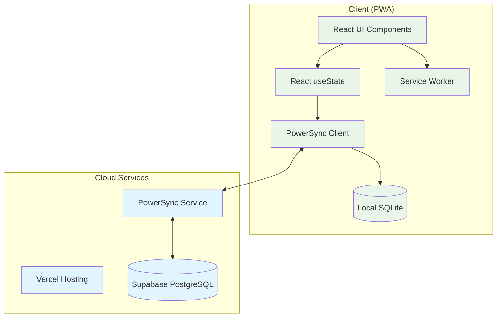

# ScoreMyClays Technical Specification

## 1. Architecture Overview

### MVP-First Approach
ScoreMyClays is built with an **ultra-simple MVP architecture** designed for rapid development and AI-agent compatibility. The system prioritizes **offline-first functionality** with cloud synchronization, targeting clay shooting scoring in environments with poor connectivity.

### Core Principles
1. **Offline-First**: All critical functions work without internet connectivity
2. **Mobile-Optimized**: Sub-100ms response times with touch-friendly interface
3. **AI-Agent Friendly**: Simple patterns that AI can easily understand and extend
4. **Progressive Enhancement**: Start simple, add complexity incrementally
5. **Real-time Sync**: Automatic data synchronization when connectivity available

## 2. Technology Stack

### MVP Technology Stack (Simplified)
- **Frontend Framework**: Next.js 14+ with App Router and TypeScript
- **Styling**: Tailwind CSS for rapid UI development
- **Database**: Supabase PostgreSQL with Row-Level Security
- **Offline Sync**: PowerSync SDK for bidirectional synchronization
- **Hosting**: Vercel with global edge network
- **Local Storage**: SQLite via PowerSync client
- **State Management**: React useState (keep it simple for MVP)
- **PWA**: next-pwa for offline capabilities

### Development Tools
- **UI Generation**: v0.dev for rapid component prototyping
- **AI Development**: Cursor with Claude for code generation
- **Testing**: Vitest for unit tests (E2E testing later)
- **Deployment**: Vercel automatic deployments

## 3. MVP Architecture Diagram



## 4. MVP Data Model

### Core Entities (Simplified)
```typescript
// MVP Data Types (TypeScript)
interface Session {
  id: string;
  shootingGround: string;
  shooterName: string;
  date: Date;
  positions: Position[];
  totalScore: number;
  totalTargets: number;
  percentage: number;
  synced: boolean;
}

interface Position {
  id: string;
  sessionId: string;
  positionNumber: number; // 1-10
  positionName: string;   // e.g., "High Tower"
  targets: Target[];
  score: number;          // hits out of 10
}

interface Target {
  id: string;
  positionId: string;
  targetNumber: number;   // 1-10 within position
  result: 'HIT' | 'MISS' | 'NO_BIRD';
  timestamp: Date;
}
```

### PowerSync Schema Configuration
```sql
-- PowerSync local SQLite schema
CREATE TABLE sessions (
  id TEXT PRIMARY KEY,
  shooting_ground TEXT NOT NULL,
  shooter_name TEXT NOT NULL,
  date TEXT NOT NULL,
  total_score INTEGER DEFAULT 0,
  total_targets INTEGER DEFAULT 100,
  percentage REAL DEFAULT 0,
  synced INTEGER DEFAULT 0,
  created_at TEXT DEFAULT CURRENT_TIMESTAMP
);

CREATE TABLE positions (
  id TEXT PRIMARY KEY,
  session_id TEXT NOT NULL,
  position_number INTEGER NOT NULL,
  position_name TEXT NOT NULL,
  score INTEGER DEFAULT 0,
  FOREIGN KEY (session_id) REFERENCES sessions(id)
);

CREATE TABLE targets (
  id TEXT PRIMARY KEY,
  position_id TEXT NOT NULL,
  target_number INTEGER NOT NULL,
  result TEXT NOT NULL CHECK (result IN ('HIT', 'MISS', 'NO_BIRD')),
  timestamp TEXT DEFAULT CURRENT_TIMESTAMP,
  FOREIGN KEY (position_id) REFERENCES positions(id)
);
```

## 5. MVP Component Architecture

### Ultra-Simple State Management
```typescript
// App.tsx - Root component with simple state
function App() {
  const [currentSession, setCurrentSession] = useState<Session | null>(null);
  const [sessionHistory, setSessionHistory] = useState<Session[]>([]);
  const [currentView, setCurrentView] = useState<'home' | 'session' | 'scoring'>('home');
  
  // PowerSync hook for offline sync
  const { syncStatus, forcSync } = usePowerSync();
  
  return (
    <div className="min-h-screen bg-gray-50">
      {currentView === 'home' && (
        <HomeScreen 
          sessionHistory={sessionHistory}
          onStartSession={(session) => {
            setCurrentSession(session);
            setCurrentView('session');
          }}
        />
      )}
      {currentView === 'session' && (
        <SessionScreen
          session={currentSession}
          onStartScoring={() => setCurrentView('scoring')}
        />
      )}
      {currentView === 'scoring' && (
        <ScoringScreen
          session={currentSession}
          onSessionComplete={() => setCurrentView('home')}
        />
      )}
    </div>
  );
}
```

### Key UI Components
```typescript
// ScoringScreen.tsx - Main scoring interface
function ScoringScreen({ session, onSessionComplete }: ScoringProps) {
  const [currentPosition, setCurrentPosition] = useState(1);
  const [currentTarget, setCurrentTarget] = useState(1);
  const [positionScore, setPositionScore] = useState(0);
  
  const recordShot = (result: 'HIT' | 'MISS' | 'NO_BIRD') => {
    // Simple state update - PowerSync handles persistence
    if (result === 'HIT') setPositionScore(prev => prev + 1);
    if (result !== 'NO_BIRD') setCurrentTarget(prev => prev + 1);
    
    // Save to PowerSync (automatic offline handling)
    saveTarget({ positionId, targetNumber: currentTarget, result });
  };
  
  return (
    <div className="p-6 max-w-md mx-auto">
      <h1 className="text-2xl font-bold">
        Position {currentPosition}: {position.name}
      </h1>
      <p className="text-xl">Target {currentTarget} of 10</p>
      <p className="text-lg">Position Score: {positionScore}/10</p>
      
      <div className="grid grid-cols-2 gap-4 mt-6">
        <button 
          onClick={() => recordShot('HIT')}
          className="bg-green-500 text-white p-6 rounded-lg text-xl font-bold"
        >
          HIT
        </button>
        <button 
          onClick={() => recordShot('MISS')}
          className="bg-red-500 text-white p-6 rounded-lg text-xl font-bold"
        >
          MISS
        </button>
        <button 
          onClick={() => recordShot('NO_BIRD')}
          className="bg-blue-500 text-white p-4 rounded-lg"
        >
          NO BIRD
        </button>
        <button 
          onClick={undoLastShot}
          className="bg-gray-500 text-white p-4 rounded-lg"
        >
          UNDO
        </button>
      </div>
    </div>
  );
}
```

## 6. Offline-First Implementation

### PowerSync Configuration
```typescript
// lib/powersync.ts
import { PowerSyncDatabase } from '@powersync/web';

export const db = new PowerSyncDatabase({
  schema: {
    sessions: {
      id: 'text',
      shooting_ground: 'text',
      shooter_name: 'text',
      total_score: 'integer',
      synced: 'integer'
    },
    positions: {
      id: 'text',
      session_id: 'text',
      position_number: 'integer',
      position_name: 'text',
      score: 'integer'
    },
    targets: {
      id: 'text',
      position_id: 'text',
      target_number: 'integer',
      result: 'text'
    }
  },
  
  // Simple sync rules for MVP
  syncRules: {
    sessions: 'SELECT * FROM sessions',
    positions: 'SELECT * FROM positions',
    targets: 'SELECT * FROM targets'
  }
});

// Initialize connection
export const initPowerSync = async () => {
  await db.init();
  await db.connect({
    endpoint: process.env.NEXT_PUBLIC_POWERSYNC_URL!,
    token: 'anonymous' // MVP uses anonymous access
  });
};
```

### Offline Data Operations
```typescript
// lib/scoring.ts - Simple data operations
export const saveSession = async (session: Session) => {
  await db.execute(
    'INSERT INTO sessions (id, shooting_ground, shooter_name, date) VALUES (?, ?, ?, ?)',
    [session.id, session.shootingGround, session.shooterName, session.date.toISOString()]
  );
};

export const saveTarget = async (target: Target) => {
  await db.execute(
    'INSERT INTO targets (id, position_id, target_number, result) VALUES (?, ?, ?, ?)',
    [target.id, target.positionId, target.targetNumber, target.result]
  );
  
  // Auto-sync when online (PowerSync handles this automatically)
};

export const getSessionHistory = async (): Promise<Session[]> => {
  const result = await db.execute('SELECT * FROM sessions ORDER BY date DESC');
  return result.rows.map(row => ({
    ...row,
    date: new Date(row.date)
  }));
};
```

## 7. PWA Configuration

### Service Worker (Minimal)
```typescript
// public/sw.js - Simple caching strategy
const CACHE_NAME = 'scoremyclays-v1';
const ESSENTIAL_URLS = [
  '/',
  '/offline',
  '/manifest.json'
];

self.addEventListener('install', (event) => {
  event.waitUntil(
    caches.open(CACHE_NAME)
      .then(cache => cache.addAll(ESSENTIAL_URLS))
  );
});

self.addEventListener('fetch', (event) => {
  // Cache-first strategy for MVP simplicity
  event.respondWith(
    caches.match(event.request)
      .then(response => response || fetch(event.request))
  );
});
```

### PWA Manifest
```json
{
  "name": "ScoreMyClays",
  "short_name": "ScoreMyClays",
  "description": "Clay shooting scoring app",
  "start_url": "/",
  "display": "standalone",
  "background_color": "#ffffff",
  "theme_color": "#22c55e",
  "icons": [
    {
      "src": "/icon-192.png",
      "sizes": "192x192",
      "type": "image/png"
    },
    {
      "src": "/icon-512.png",
      "sizes": "512x512",
      "type": "image/png"
    }
  ]
}
```

## 8. Performance Requirements

### MVP Performance Targets
- **Scoring Response Time**: < 100ms for HIT/MISS buttons
- **App Load Time**: < 3 seconds on 3G connection
- **Offline Capability**: 100% core functionality available offline
- **Sync Time**: < 5 seconds for session sync when online
- **Battery Usage**: Minimal drain during 2-hour shooting sessions

### Optimization Strategies
```typescript
// Performance optimizations for MVP
export const ScoringButton = memo(({ onClick, children, className }) => (
  <button 
    onClick={onClick}
    className={`${className} transform transition-transform active:scale-95`}
    style={{ touchAction: 'manipulation' }} // Eliminates 300ms delay
  >
    {children}
  </button>
));

// Lazy loading for non-critical screens
const SessionHistory = lazy(() => import('./SessionHistory'));
const Analytics = lazy(() => import('./Analytics'));
```

## 9. Deployment Architecture

### Vercel Configuration
```typescript
// next.config.js
const withPWA = require('next-pwa');

module.exports = withPWA({
  pwa: {
    dest: 'public',
    disable: process.env.NODE_ENV === 'development'
  },
  experimental: {
    appDir: true
  },
  env: {
    NEXT_PUBLIC_POWERSYNC_URL: process.env.NEXT_PUBLIC_POWERSYNC_URL,
    NEXT_PUBLIC_SUPABASE_URL: process.env.NEXT_PUBLIC_SUPABASE_URL,
    NEXT_PUBLIC_SUPABASE_ANON_KEY: process.env.NEXT_PUBLIC_SUPABASE_ANON_KEY
  }
});
```

### Environment Configuration
```bash
# .env.local (MVP configuration)
NEXT_PUBLIC_SUPABASE_URL=your_supabase_url
NEXT_PUBLIC_SUPABASE_ANON_KEY=your_supabase_anon_key
NEXT_PUBLIC_POWERSYNC_URL=your_powersync_url
NODE_ENV=development
```

## 10. Security Implementation

### MVP Security Approach
```typescript
// Simple security for MVP (authentication later)
export const validateSession = (session: Session): boolean => {
  return (
    session.shootingGround.length > 0 &&
    session.shooterName.length > 0 &&
    session.positions.length <= 10
  );
};

export const sanitizeInput = (input: string): string => {
  return input.trim().slice(0, 100); // Basic sanitization
};
```

## 11. Testing Strategy

### MVP Testing Approach
```typescript
// __tests__/scoring.test.ts
import { render, fireEvent, screen } from '@testing-library/react';
import ScoringScreen from '../components/ScoringScreen';

test('records hit when HIT button pressed', () => {
  render(<ScoringScreen session={mockSession} />);
  
  fireEvent.click(screen.getByText('HIT'));
  
  expect(screen.getByText('Position Score: 1/10')).toBeInTheDocument();
});

test('advances target after hit or miss', () => {
  render(<ScoringScreen session={mockSession} />);
  
  fireEvent.click(screen.getByText('HIT'));
  
  expect(screen.getByText('Target 2 of 10')).toBeInTheDocument();
});
```

## 12. Post-MVP Technical Roadmap

### Phase 1: Authentication (Post-MVP)
- Supabase Auth integration
- User profiles and data isolation
- Row-level security implementation

### Phase 2: Enhanced Features
- Multi-user sessions
- Real-time collaboration
- Advanced conflict resolution

### Phase 3: Scalability
- Database optimization
- Advanced caching strategies
- Performance monitoring

### Phase 4: Advanced Features
- Push notifications
- Advanced analytics
- Integration APIs

## 13. Development Workflow

### AI-Assisted Development
1. **Component Generation**: Use v0.dev for UI components
2. **Logic Implementation**: Cursor AI for business logic
3. **Testing**: Simple unit tests for core functionality
4. **Deployment**: Automatic Vercel deployment on git push

### Environment Setup
```bash
# Quick start for development
npm create next-app@latest scoremyclays --typescript --tailwind --app
cd scoremyclays
npm install @powersync/web @supabase/supabase-js
npm install next-pwa
npm run dev
```

## 14. Monitoring & Analytics

### MVP Monitoring (Simple)
```typescript
// Simple logging for MVP
export const logger = {
  info: (message: string, data?: any) => {
    console.log(`[INFO] ${message}`, data);
  },
  error: (message: string, error?: any) => {
    console.error(`[ERROR] ${message}`, error);
    // Vercel automatically captures console.error
  }
};

// Usage analytics (basic)
export const trackEvent = (event: string, data?: any) => {
  logger.info(`Event: ${event}`, data);
  // Add proper analytics later (Phase 2)
};
```

## Conclusion

This technical specification provides a **simplified, MVP-focused architecture** that prioritizes rapid development, offline functionality, and AI-agent compatibility. The design enables quick validation of the core concept while providing a solid foundation for future enhancements outlined in the [Product Roadmap](./ROADMAP.md).

The architecture balances simplicity with scalability, ensuring the MVP can be built quickly while supporting the evolution to a comprehensive clay shooting platform.

---

*For business context, see [Service Description](./SERVICE_DESCRIPTION.md). For feature development roadmap, see [Product Roadmap](./ROADMAP.md).*