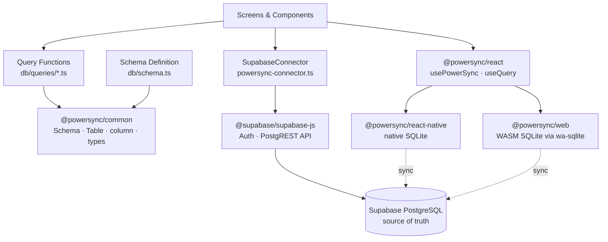
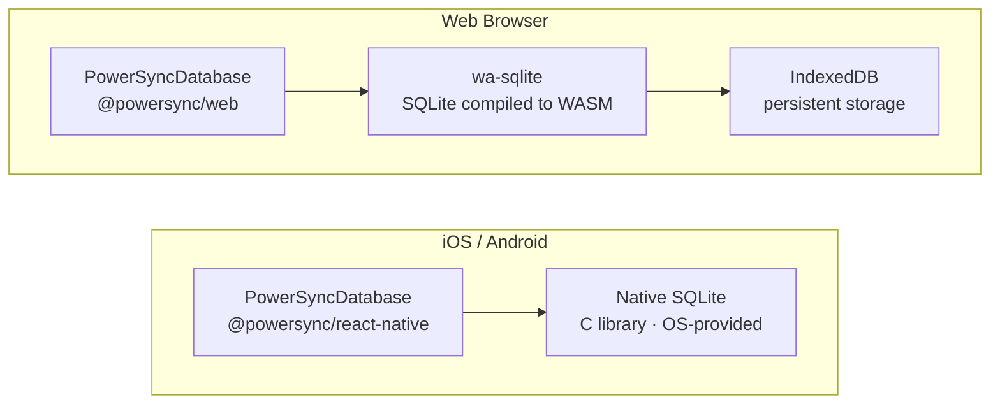
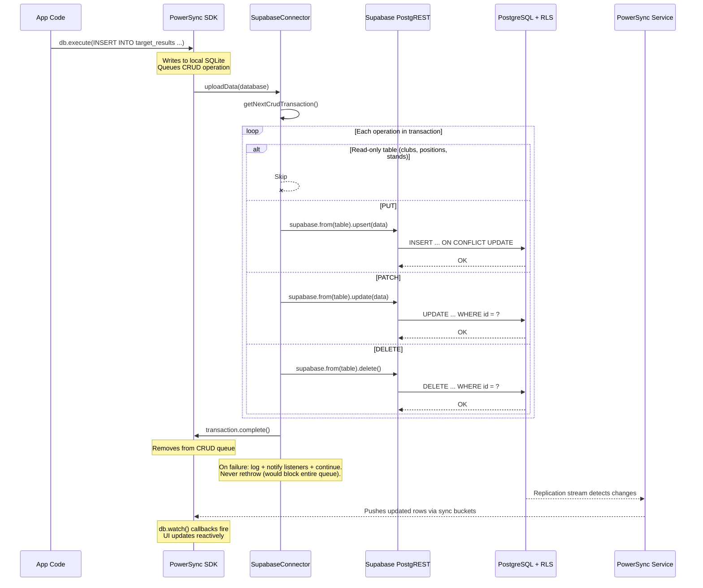
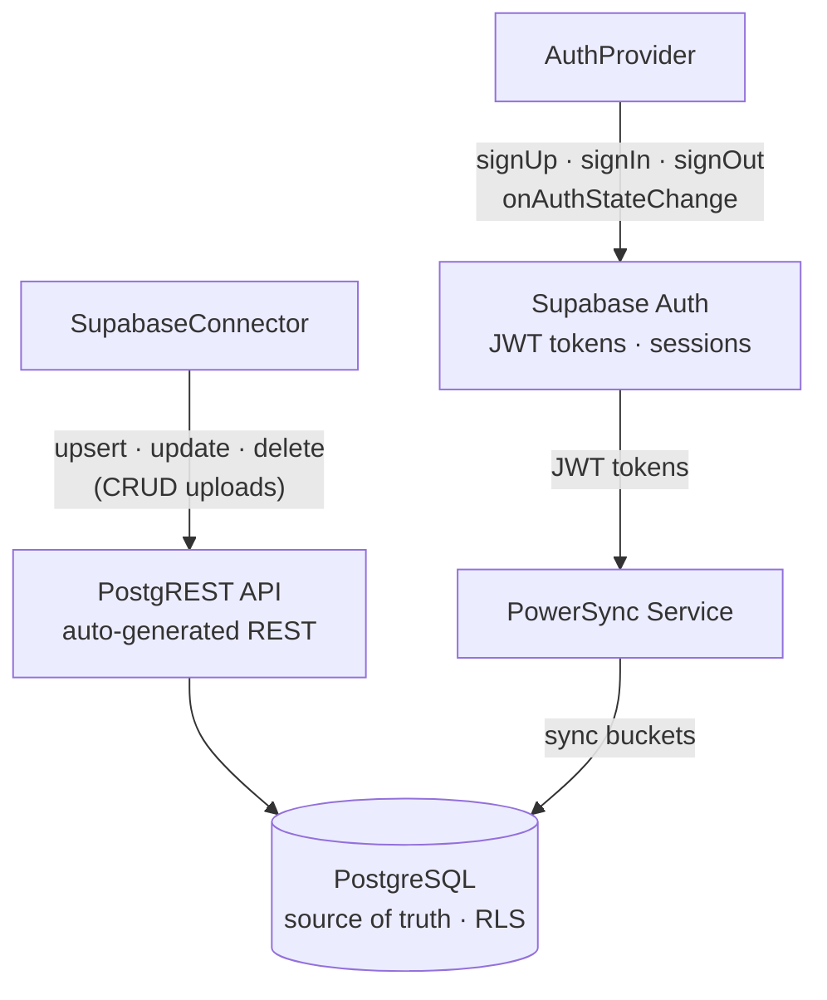

# ScoreMyClays — Codebase Review

**Date:** 2026-03-11
**Issue:** #62
**Branch:** `62-review-codebase`

---

## Table of Contents

1. [Project Overview](#1-project-overview)
2. [Tech Stack](#2-tech-stack)
3. [Architecture](#3-architecture)
4. [Data Model](#4-data-model)
5. [Sync Architecture](#5-sync-architecture)
6. [PowerSync & Supabase Deep Dive](#6-powersync--supabase-deep-dive)
7. [User Flows](#7-user-flows)
8. [Screens & Routing](#8-screens--routing)
9. [Deployment & Infrastructure](#9-deployment--infrastructure)
10. [Testing](#10-testing)
11. [Identified Improvement Areas](#11-identified-improvement-areas)

---

## 1. Project Overview

ScoreMyClays is an offline-first mobile app for recording clay pigeon shooting scores. The core problem it solves: shooting grounds typically have no mobile signal, and paper scorecards get lost or damaged.

The app syncs locally-recorded scores to the cloud when connectivity returns, supports multi-device scoring for squads, and provides a club reference system with pre-configured shooting layouts.

**Domain concepts:**
- **Round** — A scoring session at a ground (custom or club-based)
- **Stand** — A shooting position with a specific target configuration and presentation
- **Squad** — A group of up to 6 shooters in a round
- **Presentation** — How the target flies (13 types: Crosser, Driven, Incoming, Teal, Rabbit, etc.)
- **Target Config** — Single, Report Pair, Simultaneous Pair, Following Pair

---

## 2. Tech Stack

| Layer | Technology | Version |
|:------|:-----------|:--------|
| Framework | React Native | 0.83.2 |
| Platform tooling | Expo | 55.0.4 |
| Language | TypeScript | 5.9.2 |
| Routing | expo-router (file-based) | 55.0.3 |
| Navigation | @react-navigation/native | 7.1.28 |
| Local database | SQLite (via PowerSync) | expo-sqlite 55.0.4 |
| Sync engine | PowerSync (react-native + web) | 1.30.2 / 1.34.0 |
| Backend/Auth | Supabase | 2.49.4 |
| Web SQLite | @journeyapps/wa-sqlite (WASM) | 1.5.0 |
| Animations | react-native-reanimated | 4.2.1 |
| Storage | @react-native-async-storage | 2.2.0 |
| Crypto | expo-crypto | 55.0.4 |
| React | React | 19.2.0 |

**No external UI library** — all styling uses React Native's `StyleSheet.create()` with design tokens from `lib/constants.ts`.

---

## 3. Architecture

### 3.1 Provider Chain

The app wraps all screens in three nested providers:

```
RootLayout (_layout.tsx)
  └─ DatabaseProvider — Initializes SQLite, connects PowerSync sync
       └─ AuthProvider — Supabase auth, user sync, profile completeness
            └─ SyncProvider — Monitors sync status, surfaces errors
                 └─ AppContent — Auth gating, Stack navigator
```

**DatabaseProvider** (`providers/DatabaseProvider.tsx`):
- Opens platform-specific SQLite database (native vs WASM for web)
- Listens to Supabase auth state changes
- Connects/disconnects PowerSync sync on sign-in/sign-out
- Exports a shared `connector` singleton

**AuthProvider** (`providers/AuthProvider.tsx`):
- Manages authentication state via `supabase.auth.onAuthStateChange()`
- Syncs user record from Supabase to local SQLite on auth events
- Exposes `profileComplete` flag (whether `user_id` handle is set)
- Provides `signUp`, `signIn`, `signOut`, `refreshUser` methods

**SyncProvider** (`providers/SyncProvider.tsx`):
- Tracks sync status: `offline` | `syncing` | `synced`
- Maintains `lastSyncedAt` timestamp
- Captures upload/download errors from the connector
- Displays dismissible error banner on sync failures

### 3.2 Offline-First Pattern

The app uses **PowerSync** as its offline-first sync engine:

1. **Local-first writes**: All data mutations go to local SQLite first
2. **Background sync**: PowerSync queues changes and uploads to Supabase when online
3. **Bucket-based download**: Data syncs to device based on user-specific bucket rules
4. **Conflict handling**: Multiple devices can score the same targets; conflicts are detected and resolved

This means the app is fully functional without network connectivity — scores are recorded locally and sync later.

### 3.3 Platform-Specific Database

The database opener is resolved at build time via Metro:
- `db/openDatabase.native.ts` — Uses `@powersync/react-native` (native SQLite)
- `db/openDatabase.web.ts` — Uses `@powersync/web` with WASM SQLite (`wa-sqlite`)

---

## 4. Data Model

### 4.1 Tables (10 total)

| Table | Purpose | Key Columns |
|:------|:--------|:------------|
| `users` | User profiles | id, display_name, email, user_id (handle), discoverable, favourite_club_ids (JSON), gear (JSON) |
| `rounds` | Shooting sessions | id, created_by, ground_name, date, total_targets, status, club_id |
| `squads` | Shooter groups within rounds | id, round_id |
| `shooter_entries` | Individual shooters in a squad | id, squad_id, round_id, user_id (nullable), shooter_name, position_in_squad |
| `stands` | Shooting positions in a round | id, round_id, stand_number, target_config, presentation, num_targets, club_stand_id |
| `target_results` | Individual shot records | id, stand_id, round_id, shooter_entry_id, target_number, bird_number, result, recorded_by, device_id |
| `clubs` | Reference club data (read-only) | id, name, description |
| `club_positions` | Positions at a club | id, club_id, position_number, name |
| `club_stands` | Stands within a position | id, club_position_id, stand_number, target_config, presentation, num_targets |
| `invites` | Round invitations | id, round_id, inviter_id, invitee_id, invitee_user_id, status |

### 4.2 Enums

- **RoundStatus**: `IN_PROGRESS`, `COMPLETED`, `ABANDONED`
- **ShotResult**: `KILL`, `LOSS`, `NO_SHOT`
- **TargetConfig**: `SINGLE`, `REPORT_PAIR`, `SIMULTANEOUS_PAIR`, `FOLLOWING_PAIR`
- **PresentationType**: 13 types (Crosser, Driven, Incoming, Going Away, Quartering Away, Quartering Towards, Teal, Dropping, Looper, Rabbit, Battue, Chandelle, Springing)
- **InviteStatus**: `PENDING`, `ACCEPTED`, `DECLINED`

### 4.3 Relationships

```
Users ──(created_by)──> Rounds
                          ├── Squads (1:1)
                          │     └── ShooterEntries (1:N) ──> Users (optional)
                          │           └── TargetResults (1:N)
                          ├── Stands (1:N)
                          │     └── TargetResults (1:N)
                          └── Invites (1:N) ──> Users (inviter + invitee)

Clubs (reference data)
  └── ClubPositions (1:N)
        └── ClubStands (1:N)
              └── referenced by Stands.club_stand_id
```

### 4.4 Denormalization

`round_id` is denormalized into `shooter_entries` and `target_results`. This is intentional — PowerSync sync rules require single-table parameter queries, so JOINs aren't available for bucket definitions.

### 4.5 Seed Data

8 UK shooting clubs are seeded with realistic layouts (3-6 positions each, 2-5 stands per position): Donarton, Northumberland, West Midlands, Highland, Surrey Hills, Yorkshire, Cornish, Borders.

---

## 5. Sync Architecture

### 5.1 PowerSync Connector

`lib/powersync-connector.ts` implements the `PowerSyncBackendConnector` interface:

- **fetchCredentials()**: Returns PowerSync endpoint + Supabase JWT
- **uploadData()**: Processes CRUD operations from the local queue
  - Skips read-only tables: `clubs`, `club_positions`, `club_stands`
  - Performs upsert/update/delete via Supabase API
  - Non-retryable errors (RLS violations, constraint failures) are logged and skipped to prevent queue blocking

### 5.2 Bucket-Based Sync Rules

Defined in `supabase/powersync-sync-rules.yaml` — 8 buckets control what data syncs to each device:

| Bucket | What Syncs | Trigger |
|:-------|:-----------|:--------|
| `user_profile` | User's own record | Always (by auth uid) |
| `discoverable_users` | All users with discoverable=1 | Always |
| `my_rounds` | Rounds created by user + all related data | User is `created_by` |
| `shared_rounds` | Rounds where user is a shooter entry | User appears in `shooter_entries` |
| `invited_rounds` | Rounds with pending invites for user | Invite exists with user as invitee |
| `sent_invites` | Invites sent by user | User is `inviter_id` |
| `received_invites` | Invites received by user | User is `invitee_id` |
| `reference_data` | All clubs, positions, stands | Always (global) |

### 5.3 Conflict Resolution

#### Why conflicts happen

Any squad member can score for any shooter. Two devices can be offline at the same shooting ground (common — grounds have poor signal), both scoring the same shooter at the same stand. Each device writes to its own local SQLite database. When connectivity returns, both devices sync their writes up to Supabase via the CRUD upload queue.

The critical detail: each `target_results` row gets a **random UUID** as its primary key (`Crypto.randomUUID()` in `score.tsx:399`). PowerSync's sync engine operates at the row level using primary keys — it sees two rows with different IDs and treats them as two distinct, valid records. There is no sync-level conflict because the primary keys don't collide.

The conflict is **application-level, not sync-level**. The app's domain rule is that a given `(shooter_entry_id, target_number, bird_number)` combination should have exactly one result. But this composite key is not the primary key, so PowerSync has no way to enforce uniqueness — both rows sync successfully to all devices.

#### How the app detects conflicts

`getRoundConflicts()` in `db/queries/scoring.ts` groups `target_results` by `(shooter_entry_id, target_number, bird_number)` and looks for groups with `COUNT(*) > 1`. Each group represents a single shot that was recorded by multiple devices.

#### How conflicts affect scoring

While conflicts exist, the app protects score integrity at multiple levels:

1. **Score suppression**: `getShooterRoundScore()` runs the conflict check first. If any duplicates exist for a shooter, it returns `kills: 0, total: 0, hasConflicts: true` — scores are suppressed entirely rather than showing inflated or ambiguous numbers.

2. **Active scoring deduplication**: `getResultsForStandAndShooter()` orders rows by `created_at ASC` and keeps only the first record per `(target_number, bird_number)` pair. This ensures the scoring state machine doesn't skip ahead or double-count during active scoring, even if a sync brings in a duplicate mid-round.

3. **UI warnings**: The summary screen shows "Sync Issue" badges on affected shooters. The scoring screen shows a conflict warning for the active shooter.

#### How conflicts are resolved

Only the round creator can resolve conflicts (enforced by an auth check in `conflicts.tsx:36`). The resolution screen:

1. Groups conflicts by shooter, target, and bird
2. Shows each competing record with the result (KILL/LOSS), who recorded it, and when
3. The round creator selects the correct record for each group
4. On commit, `resolveConflict()` deletes the losing rows in a `writeTransaction` — these deletes sync to all devices via the normal CRUD upload path

#### What about non-target_results conflicts?

The conflict system only covers `target_results`. For other tables (e.g. two devices updating a round's status simultaneously), PowerSync uses **last-write-wins** at the row level — whichever `UPDATE` syncs last overwrites the other. The app doesn't have explicit handling for this case. In practice, round metadata changes (status updates, notes) are typically made by one device (the round creator), so last-write-wins is unlikely to cause data loss.

### 5.4 RLS & Security Functions

Supabase Row Level Security policies enforce access control. To prevent RLS recursion (policies querying tables that themselves have RLS), four `SECURITY DEFINER` functions exist:
- `get_user_squad_ids(uid)` — squads the user belongs to
- `get_user_round_ids(uid)` — all accessible round IDs
- `is_round_owner(rid, uid)` — ownership check
- `has_pending_invite(rid, uid)` — invite existence check

### 5.5 Migration History

| # | Migration | Purpose |
|:--|:----------|:--------|
| 001 | initial_schema | All tables, indexes, RLS, publication |
| 002 | denormalize_round_id | Add round_id to shooter_entries, target_results |
| 003 | fix_rls_recursion | SECURITY DEFINER function for shooter_entries |
| 004 | seed_clubs | Insert 8 clubs with positions and stands |
| 005 | fix_all_rls_recursion | SECURITY DEFINER functions for remaining tables |
| 006 | add_invitee_id | UUID invitee_id column on invites |
| 007 | allow_invitee_shooter_entry | Let invitees INSERT their own shooter_entry |
| 008 | allow_squad_scoring | Let squad members write to target_results |
| 010 | unique_club_stand_per_round | Prevent duplicate stand creation (race condition fix) |

---

## 6. PowerSync & Supabase Deep Dive

This section explains exactly how the app uses the PowerSync SDK, how PowerSync interacts with Supabase, and why separate SQLite implementations are required for native and web platforms.

### 6.1 Package Architecture

The app depends on four PowerSync packages plus the Supabase client:



| Package | Version | Role in the App |
|:--------|:--------|:----------------|
| `@powersync/common` | (transitive) | Schema definition (`Schema`, `Table`, `column`), type abstractions (`AbstractPowerSyncDatabase`, `PowerSyncBackendConnector`, `UpdateType`), platform-agnostic query interface |
| `@powersync/react` | (transitive) | React hooks (`usePowerSync`, `useQuery`), context provider (`PowerSyncContext`) |
| `@powersync/react-native` | 1.30.2 | `PowerSyncDatabase` class for iOS/Android — wraps native SQLite via `expo-sqlite` |
| `@powersync/web` | 1.34.0 | `PowerSyncDatabase` class for browsers — wraps WASM SQLite via `@journeyapps/wa-sqlite` |
| `@supabase/supabase-js` | 2.49.4 | Auth (email/password), PostgREST API client (CRUD uploads), session management |

### 6.2 Why Two SQLite Implementations?

PowerSync needs a local SQLite database on every platform. The problem is that **SQLite doesn't exist natively in web browsers**, and the way you access SQLite on iOS/Android is fundamentally different from how you access it in a browser:



**Native (iOS/Android):** The operating system provides SQLite as a C library. `@powersync/react-native` uses `expo-sqlite` to access it via a native bridge — fast, well-tested, and the standard approach for React Native apps.

**Web:** Browsers have no SQLite. `@powersync/web` solves this by using `wa-sqlite` — the SQLite C source code **compiled to WebAssembly (WASM)**. The compiled `.wasm` binary runs in the browser and stores data in IndexedDB for persistence. This is why the `postinstall` script copies WASM files to `public/`:

```
npx powersync-web copy-assets --output public
cp node_modules/@journeyapps/wa-sqlite/dist/wa-sqlite-async.wasm public/
```

Both packages export a `PowerSyncDatabase` class with an identical API — the app code doesn't know which platform it's running on. The split is handled entirely at the import level.

### 6.3 Platform Resolution via Metro

The app uses Metro's platform-specific file extension resolution to pick the right package at build time:

| File | Resolved On | Creates |
|:-----|:------------|:--------|
| `db/openDatabase.native.ts` | iOS, Android | `PowerSyncDatabase` from `@powersync/react-native` |
| `db/openDatabase.web.ts` | Web (browser) | `PowerSyncDatabase` from `@powersync/web` |
| `db/openDatabase.d.ts` | TypeScript | Type declaration using `AbstractPowerSyncDatabase` from `@powersync/common` |

When any file imports `@/db/openDatabase`, Metro resolves it to `.native.ts` or `.web.ts` based on the build target. Both files export the same `db` constant with the same schema — the `AppSchema` from `db/schema.ts`.

The type declaration file (`openDatabase.d.ts`) uses the abstract type from `@powersync/common` so that all query functions type-check against the platform-agnostic interface, not a specific platform package.

### 6.4 Schema Definition Layer

The PowerSync schema is defined in `db/schema.ts` using primitives from `@powersync/common`:

- **`Schema`** — Container for all table definitions, passed to `PowerSyncDatabase` constructor
- **`Table`** — Defines a table's columns and optional indexes
- **`column`** — Column type helpers (`column.text`, `column.integer`)

The schema mirrors the Supabase PostgreSQL tables but uses only two column types (text and integer) — PowerSync's SQLite layer doesn't need the full Postgres type system. JSON data (like `favourite_club_ids` and `gear`) is stored as `column.text` and parsed in application code.

The schema also defines **local indexes** that PowerSync creates in the SQLite database for query performance — these are independent of any Postgres indexes on the Supabase side.

### 6.5 PowerSync SDK Methods Used

Every database interaction in the app goes through the `AbstractPowerSyncDatabase` interface. Here is the complete inventory of SDK methods used:

| Method | Purpose | Used In |
|:-------|:--------|:--------|
| `db.init()` | Initialize the local SQLite database and apply the schema | `DatabaseProvider.tsx` (once, on mount) |
| `db.connect(connector)` | Start bidirectional sync using the provided connector | `DatabaseProvider.tsx` (on auth sign-in) |
| `db.disconnect()` | Stop sync | `DatabaseProvider.tsx` (on auth sign-out) |
| `db.connected` | Boolean — whether sync is currently active | `DatabaseProvider.tsx` (guard before connecting) |
| `db.execute(sql, params)` | Execute a write query (INSERT, UPDATE, DELETE) | All `db/queries/*.ts` files, `AuthProvider.tsx`, `db/seed-clubs.ts` |
| `db.getAll<T>(sql, params)` | Execute a read query, return all rows typed as `T` | All `db/queries/*.ts` files, profile screens |
| `db.writeTransaction(callback)` | Execute multiple writes atomically | `new-round.tsx` (round+squad+shooter creation), `scoring.ts` (conflict resolution) |
| `db.watch(sql, params, callbacks, options)` | Subscribe to live query results — re-executes on any table change | `score.tsx` (4 watchers), `AuthProvider.tsx` (1 watcher), `setup.tsx` (via `useQuery`) |
| `db.getNextCrudTransaction()` | Get the next batch of local changes to upload | `powersync-connector.ts` (upload queue) |
| `db.currentStatus` | Current sync status object | `SyncProvider.tsx` |
| `db.registerListener({ statusChanged })` | Listen for sync status changes | `SyncProvider.tsx` |
| `transaction.crud` | Array of CRUD operations in a transaction | `powersync-connector.ts` (iterate upload ops) |
| `transaction.complete()` | Mark a CRUD transaction as uploaded | `powersync-connector.ts` (after processing) |

### 6.6 PowerSync React Hooks

| Hook | Purpose | Used In |
|:-----|:--------|:--------|
| `usePowerSync()` | Access the `db` instance from React context | Every screen and component (16 files) |
| `useQuery<T>(sql, params)` | Reactive query — automatically re-renders when underlying data changes | `setup.tsx` (watching pending invites) |

`usePowerSync()` is the primary access pattern — screens call it to get `db`, then pass `db` to query functions. `useQuery` is used in only one place (the setup screen's pending invite watcher) because most reactive data uses `db.watch()` directly for finer control over when re-renders happen.

### 6.7 The `db.watch()` Reactive Pattern

`db.watch()` is the app's mechanism for **real-time UI updates from sync**. It subscribes to a SQL query and re-executes it whenever any row in the referenced tables changes — whether from local writes or from PowerSync downloading changes from other devices.

The app uses 5 watchers across 2 files:

**In `score.tsx` (4 watchers):**

| Watcher | Query | Updates When... |
|:--------|:------|:----------------|
| Shooter entries | `SELECT se.*, u.user_id AS user_handle FROM shooter_entries se LEFT JOIN users u ON se.user_id = u.id WHERE se.squad_id = ?` | A new shooter joins the squad via invite acceptance on another device |
| Stands (club rounds) | `SELECT id, club_stand_id FROM stands WHERE round_id = ?` | Another device creates a stand for the same club round |
| Shooter statuses | `SELECT shooter_entry_id, COUNT(*) FROM target_results WHERE stand_id = ? GROUP BY shooter_entry_id` | Any score recorded for the current stand (by any device) |
| Live score | `SELECT id FROM target_results WHERE stand_id = ? AND shooter_entry_id = ?` | Current shooter's scores change (self or sync) |

**In `AuthProvider.tsx` (1 watcher):**

| Watcher | Query | Updates When... |
|:--------|:------|:----------------|
| User profile | `SELECT * FROM users WHERE id = ?` | PowerSync syncs the real user profile after initial blank insert |

All watchers use `AbortController` for cleanup — when the component unmounts or dependencies change, the watcher is aborted to prevent memory leaks and stale updates.

### 6.8 The PowerSyncBackendConnector

The `SupabaseConnector` class in `lib/powersync-connector.ts` implements the `PowerSyncBackendConnector` interface — the bridge between PowerSync and Supabase. It has two required methods:

**`fetchCredentials()`** — Returns the PowerSync endpoint URL and a Supabase JWT access token. PowerSync uses these to authenticate with the PowerSync Service (a cloud proxy that reads from Supabase PostgreSQL and pushes changes to devices). The session is cached to avoid calling `supabase.auth.getSession()` during `onAuthStateChange` (which would deadlock).

**`uploadData(database)`** — Called by PowerSync when local changes need to be pushed to Supabase. This is the CRUD upload queue processor.

### 6.9 CRUD Upload Lifecycle

When the app writes to the local database, PowerSync queues those changes and calls `uploadData()` to push them to Supabase:



**Important: The three participants on the left (App Code, PowerSync SDK, SupabaseConnector) all run on the device. The PowerSync Service runs in the cloud. The write path (left to right) goes directly from the device to Supabase — it does not route through PowerSync Service. The sync-down path (bottom right) is a separate process where PowerSync Service pushes changes from PostgreSQL to other devices.**

Key design decisions in the upload flow:

1. **Read-only table skipping**: `clubs`, `club_positions`, and `club_stands` are reference data seeded via migrations. The connector skips their CRUD ops — attempting to upload them would fail Supabase RLS anyway and block the queue.

2. **Non-retryable error handling**: If an upload fails (RLS violation, unique constraint), the error is logged and the connector continues to the next operation. Rethrowing would permanently block the CRUD queue, preventing all future uploads including valid ones.

3. **Error listener pattern**: The connector emits errors to registered listeners (used by `SyncProvider` to show the error banner), keeping error handling decoupled from the upload logic.

### 6.9.1 Offline Queue and Connectivity Resume

The CRUD upload queue is central to the app's offline-first design. When the device has no connectivity, writes continue locally and queue up. When connectivity returns, the queue drains.

**Verified in app code (`powersync-connector.ts`, `DatabaseProvider.tsx`):**

- All writes go through `db.execute()` / `db.writeTransaction()`, which write to local SQLite and queue CRUD operations — this is the PowerSync SDK's standard write path
- `uploadData()` processes one transaction at a time via `getNextCrudTransaction()`, calling Supabase PostgREST directly (not via PowerSync Service)
- Non-retryable errors (RLS violations, constraint failures) are caught and logged — the connector moves to the next operation rather than blocking the queue
- `db.connect(connector)` is called on auth sign-in, `db.disconnect()` on sign-out — the app delegates connection lifecycle to the SDK after that

**Verified SDK behaviour (confirmed against SDK source and documentation, #72):**

1. **Automatic connectivity detection** — The SDK does NOT use platform network APIs (e.g. `navigator.onLine`, React Native `NetInfo`). Connectivity is derived from the sync stream itself: when the WebSocket connection to the PowerSync service reconnects after a network outage, the SDK sets `connected: true` via `updateSyncStatus()`, which restarts CRUD uploads. There is a brief window between "network returns" and "WebSocket reconnects" where uploads remain paused — this is by design, not a gap the app needs to fill. Source: [`AbstractStreamingSyncImplementation.ts`](https://github.com/powersync-ja/powersync-js/blob/main/packages/common/src/client/sync/stream/AbstractStreamingSyncImplementation.ts), method `_uploadAllCrud()` checks `this.isConnected`.

2. **Queue drain loop** — The SDK calls `uploadData()` in a `while` loop inside `_uploadAllCrud()`. Each iteration calls `nextCrudItem()` to check for pending items; if items exist, it invokes `uploadData()` (the connector's implementation). On success, it loops immediately. When the queue is empty, it breaks. The loop is triggered via `triggerCrudUpload`, which is throttled by `crudUploadThrottleMs` (default: 1000ms) — meaning after a local write, there is up to a 1-second delay before the drain loop starts, but once running it processes continuously. Source: `AbstractStreamingSyncImplementation.ts`, methods `_uploadAllCrud()` and `triggerCrudUpload`.

3. **Transient failure retry** — When `uploadData()` throws an error, the SDK waits `retryDelayMs` (default: 5000ms / 5 seconds) then retries. This is a **fixed-interval retry, not exponential backoff**. When `uploadData()` completes normally, the next item is processed immediately with no delay. If the connection drops during an error retry, the loop exits entirely. Both `retryDelayMs` and `crudUploadThrottleMs` are configurable via `db.connect()` options. Source: `AbstractStreamingSyncImplementation.ts` catch block + `delayRetry()`. Documentation: [Handling Write/Validation Errors](https://docs.powersync.com/usage/lifecycle-maintenance/handling-write-validation-errors).

4. **Queue persistence across restarts** — The CRUD queue is stored in the `ps_crud` SQLite table with columns `id` (auto-increment PK enforcing FIFO), `tx_id` (transaction grouping), and `data` (JSON-serialised operation). This table persists across app kills, restarts, device reboots, and SDK version upgrades — it is the only internal table that is NOT dropped and recreated on upgrade. On restart, calling `db.connect()` re-reads `ps_crud` and resumes uploads. Source: `AbstractPowerSyncDatabase.ts`, methods `getCrudBatch()` and `getNextCrudTransaction()`. Documentation: [Client Architecture](https://docs.powersync.com/architecture/client-architecture).

5. **Platform consistency** — The CRUD queue logic (drain loop, retry, persistence) lives entirely in `@powersync/common`, which both `@powersync/react-native` and `@powersync/web` extend. Queue behaviour is identical across platforms. Platform-specific differences are limited to:
   - **SQLite driver**: React Native uses `op-sqlite` (native C++ via JSI); Web uses `wa-sqlite` (WebAssembly) with OPFS or IndexedDB storage
   - **Transport**: Both default to WebSocket; React Native had an iOS-specific reconnection bug fixed in v1.21.0
   - **Sync worker**: Web runs sync in a shared web worker for multi-tab coordination; React Native runs in-process
   - **Web storage caveat**: Users clearing browser storage will lose the queue — a web platform constraint, not a PowerSync limitation

**App-level duplication review:** No app-level code duplicates SDK behaviour. `DatabaseProvider.tsx` manages auth lifecycle (connect on sign-in, disconnect on sign-out), not connectivity detection. The SDK handles network reconnection and queue drain internally after `db.connect()` is called.

### 6.10 How Supabase Is Used

Supabase serves three distinct roles in the architecture:



**Role 1: Authentication** — The Supabase client (`lib/supabase.ts`) handles all auth. The app never touches passwords or tokens directly.

| Supabase Auth Method | Used In | Purpose |
|:---------------------|:--------|:--------|
| `supabase.auth.signUp({ email, password })` | `AuthProvider.tsx` | Create new account |
| `supabase.auth.signInWithPassword({ email, password })` | `AuthProvider.tsx` | Log in |
| `supabase.auth.signOut()` | `AuthProvider.tsx` | Log out |
| `supabase.auth.onAuthStateChange(callback)` | `AuthProvider.tsx`, `DatabaseProvider.tsx` | React to auth events (SIGNED_IN, SIGNED_OUT, TOKEN_REFRESHED, INITIAL_SESSION) |

**Role 2: CRUD API** — The PostgREST API auto-generated from the Supabase schema is used exclusively by the `SupabaseConnector` to upload local changes:

| Supabase API Method | Used In | Purpose |
|:--------------------|:--------|:--------|
| `supabase.from(table).upsert(data)` | `powersync-connector.ts` | PUT operations (insert or update) |
| `supabase.from(table).update(data).eq('id', id)` | `powersync-connector.ts` | PATCH operations (partial update) |
| `supabase.from(table).delete().eq('id', id)` | `powersync-connector.ts` | DELETE operations |

The app **never reads from Supabase directly** during normal operation. All reads go through the local PowerSync SQLite database. Supabase is only contacted for auth and for uploading local changes.

**Role 3: PostgreSQL Backend** — Supabase PostgreSQL is the source of truth. PowerSync Service connects to it to read changes and push them to devices via sync buckets. RLS policies enforce access control at the database level.

### 6.11 Supabase Client Configuration

The Supabase client (`lib/supabase.ts`) is configured with platform-specific session storage:

| Platform | Storage Backend | Why |
|:---------|:----------------|:----|
| Web | `window.localStorage` | Standard browser persistence — survives page refreshes |
| iOS/Android | `@react-native-async-storage/async-storage` | React Native has no `localStorage` — AsyncStorage is the standard persistent key-value store |

Other configuration: `autoRefreshToken: true` (keeps the JWT fresh), `persistSession: true` (survives app restarts), `detectSessionInUrl: false` (not using OAuth redirects).

### 6.12 Web-Specific Workarounds

Running PowerSync's web package through Metro (Expo's bundler) requires three workarounds that the native package does not need:

**1. Babel transform for `import.meta`** (`babel.config.js`)

`@powersync/web` uses `import.meta.url` internally (an ES module feature). Metro doesn't support ES module metadata. A custom Babel plugin transforms `import.meta` into `{ url: globalThis.location?.href ?? '/' }` at build time.

**2. SharedWorker disabled** (`openDatabase.web.ts`)

PowerSync's web adapter defaults to running SQLite operations in a SharedWorker for better performance. Metro's bundling doesn't support SharedWorker properly, so the app sets `useWebWorker: false`, running all database operations on the main thread instead. The native package doesn't have this issue because native SQLite runs in its own thread automatically.

**3. WASM asset pipeline** (`postinstall` script)

The wa-sqlite WASM binary must be served as a static file. Metro can't serve arbitrary binary files from `node_modules`, so the `postinstall` script copies the `.wasm` files to `public/` where Metro's static file server can find them.

None of these workarounds affect the native build — they exist solely because web browsers require a fundamentally different SQLite engine (WASM) accessed through a fundamentally different bundler path (Metro for web).

---

## 7. User Flows

### 7.1 Authentication

```
Unauthenticated ──> Login / Signup
                        │
                  (Supabase Auth)
                        │
                  Authenticated, no profile?
                        │
                  Yes ──> Profile Setup (display name, @handle, clubs, gear)
                        │
                  No ──> Home (tabs)
```

- Email/password auth via Supabase
- Profile setup requires unique `@handle` (3-20 chars, alphanumeric + underscore + hyphen)
- Real-time availability check on handle with debounce
- Optional: favourite clubs, gear list, discoverable toggle

### 7.2 Round Creation

```
New Round tab
  │
  ├─ Optional: Search and select a club (auto-fills ground name)
  ├─ Set ground name (or auto-filled)
  ├─ Date: today (read-only)
  ├─ Total targets: 25/50/75/100 (custom rounds only)
  │
  └─ Create ──> Inserts: round + squad + creator as shooter_entry
                    │
                    └─> Round Setup screen
```

### 7.3 Round Setup

From the setup screen, the round creator can:
- View stands (club rounds show pre-configured positions; custom rounds allow adding/deleting)
- Manage squad: add shooters by name (guest) or invite registered users via `@handle` search
- View pending invites and their status
- Start scoring when at least 1 stand and 1 shooter exist

### 7.4 Scoring — Custom Rounds

```
Select shooter (ShooterPicker)
  │
  └─ For each stand (sequential):
       │
       ├─ For each target:
       │    ├─ For each bird in target:
       │    │    └─ Tap: KILL / LOSS / NO SHOT
       │    │         └─ Records target_result row
       │    └─ Next bird/target
       │
       └─ Stand Complete! ──> Choose next shooter or next stand
```

- Top bar shows: running score (kills/total), current stand + presentation, current shooter
- Real-time score updates via reactive watches on `target_results`
- Handles pair targets (2 birds per target)

### 7.5 Scoring — Club Rounds

```
Select position (PositionPicker — card grid with status)
  │
  └─ Select stand within position (StandSelector)
       │
       └─ Select shooter (ShooterPicker)
            │
            └─ Score targets (same as custom)
```

Club rounds add a position layer and allow non-sequential stand selection.

### 7.6 Invite Acceptance

```
Invitee receives invite (syncs via received_invites bucket)
  │
  └─ Invites screen: View pending invites
       │
       ├─ Accept:
       │    ├─ Check squad not full (max 6)
       │    ├─ Add self as shooter_entry
       │    ├─ Update invite status to ACCEPTED
       │    └─ Route to score (IN_PROGRESS) or summary (COMPLETED)
       │
       └─ Decline:
            └─ Update invite status to DECLINED
```

The `invited_rounds` sync bucket ensures the invitee can see round data even before accepting (needed to display the invite details).

---

## 8. Screens & Routing

### 8.1 Route Map

| Route | Screen | Purpose |
|:------|:-------|:--------|
| `/auth/login` | Login | Email/password login |
| `/auth/signup` | Signup | Account creation |
| `/auth/profile-setup` | Profile Setup | First-time profile completion |
| `/(tabs)/` | Home | Dashboard with recent rounds and invites |
| `/(tabs)/new-round` | New Round | Create a round |
| `/(tabs)/clubs` | Clubs | Browse and search clubs |
| `/(tabs)/history` | History | All rounds (past and current) |
| `/(tabs)/profile` | Profile | User profile and settings |
| `/profile/edit` | Edit Profile | Modify profile settings |
| `/clubs/[id]` | Club Detail | View club layout, start club round |
| `/round/[id]/setup` | Round Setup | Configure squad and stands |
| `/round/[id]/score` | Scoring | Record shot results |
| `/round/[id]/summary` | Summary | View final scores and breakdown |
| `/round/[id]/conflicts` | Conflicts | Resolve sync conflicts (creator only) |
| `/invites` | Invites | Manage pending round invitations |

### 8.2 Tab Navigation

5 bottom tabs: Home, New Round, Clubs, History, Profile.

### 8.3 Shared Components

| Component | Used By | Purpose |
|:----------|:--------|:--------|
| `LoadingPlaceholder` | Multiple screens | Centered spinner with message |
| `PositionPicker` | Scoring (club rounds) | Position selection grid with status |
| `ShooterPicker` | Scoring (all rounds) | Shooter selection with progress |
| `StandSelector` | Scoring (club rounds) | Stand selection within position |
| `UserSearch` | Round Setup | Search and invite users by handle |

---

## 9. Deployment & Infrastructure

### 9.1 Expo Configuration

- **App name**: ScoreMyClays
- **Bundle IDs**: `com.scoremyclays.app` (iOS and Android)
- **Deep link scheme**: `scoremyclays://`
- **Orientation**: Portrait only
- **Typed routes**: Enabled (strict type safety for expo-router)

### 9.2 Backend: Supabase

- **Authentication**: Email/password via Supabase Auth
- **Database**: PostgreSQL with RLS policies
- **Real-time sync**: Via PowerSync (not Supabase Realtime)
- **API**: Used for CRUD uploads from PowerSync connector

### 9.3 Sync: PowerSync

- **Endpoint**: Configured via environment variables
- **Local storage**: SQLite (native) or WASM SQLite (web)
- **Sync rules**: YAML-defined bucket rules in `supabase/powersync-sync-rules.yaml`
- **WASM assets**: Copied to `public/` via postinstall script

### 9.4 Platforms

The app targets three platforms:
- **iOS** — Native via Expo
- **Android** — Native via Expo
- **Web** — Via react-native-web + WASM SQLite

---

## 10. Testing

### Current State: Zero Coverage

There are **no test files** anywhere in the project:
- No `*.test.ts` or `*.test.tsx` files
- No `*.spec.ts` or `*.spec.tsx` files
- No `__tests__/` directories
- No testing framework configured in `package.json` (no jest, vitest, or testing-library)

The app is entirely untested at the code level. All quality assurance is currently manual.

---

## 11. Identified Improvement Areas

### 11.1 Testing (Critical)

The complete absence of tests is the most significant gap. Priority areas for test coverage:
- **Query functions** (`db/queries/`): Pure functions operating on a database — ideal for unit testing
- **Scoring logic** (`db/queries/scoring.ts`): Conflict detection, deduplication, score calculation
- **Auth flow** (`providers/AuthProvider.tsx`): User sync logic, profile completeness checks
- **PowerSync connector** (`lib/powersync-connector.ts`): Upload error handling, read-only table skipping

### 11.2 Error Handling

- Auth errors are logged to console but not always surfaced to users
- Sync upload errors are caught but the error banner is the only user-facing indicator
- No retry mechanism for failed uploads beyond PowerSync's built-in queue

### 11.3 Design System Formalization

Design tokens exist in `lib/constants.ts` but there is no component library:
- Every screen builds its own styled components via `StyleSheet.create()`
- Common patterns (cards, buttons, inputs, badges) are duplicated across screens
- Extracting shared primitives would reduce code duplication and ensure visual consistency

### 11.4 Input Validation

- Client-side validation exists for profile setup but is inconsistent across other forms
- No server-side validation beyond RLS policies — Supabase constraints are the last line of defense

### 11.5 Accessibility

- `MIN_TAP_TARGET_SIZE = 48` is defined and used in some components
- No screen reader annotations, ARIA labels, or accessibility testing
- Color contrast has not been formally validated

### 11.6 Documentation

Documentation in `docs/` covers architecture, flows, and query API well. No significant gaps remain.

### 11.7 Code Organization

- The scoring screen (`app/round/[id]/score.tsx`) is the most complex file in the codebase — it handles two distinct scoring modes (custom vs club) with a state machine. Consider extracting the state machine logic into a custom hook.
- `lib/types.ts` mixes enums and interfaces — separating these could improve discoverability.
